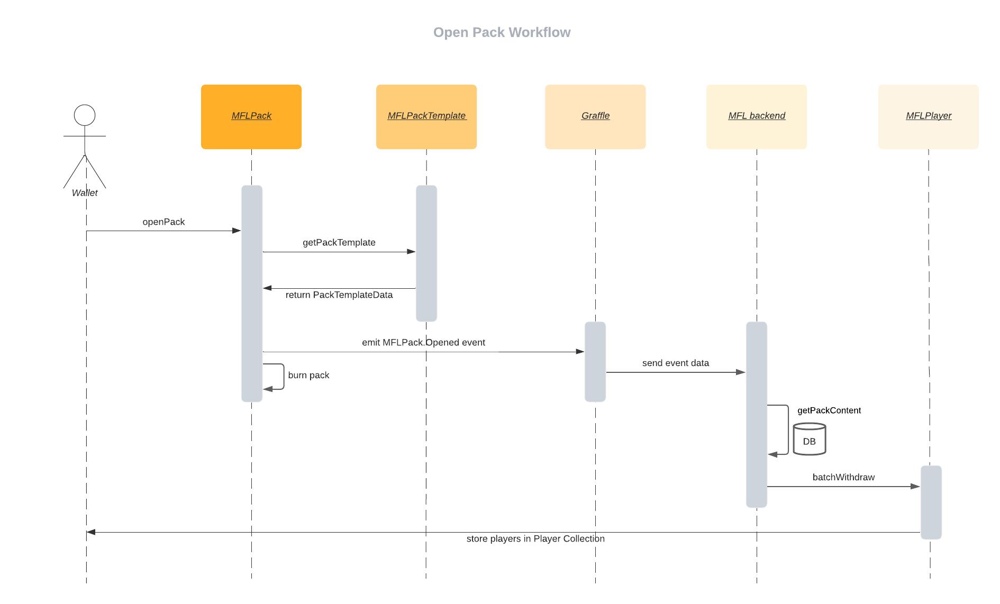

# Open Pack Workflow

## Transaction

> This transaction is whitelisted by Dapper

Parameters:

Name     | Description
------   | ------
revealID | Id of the pack we want to open 

First, the `open_pack.tx.cdc` transaction creates a Player Collection if the account doesn't have one (because the account must be able to receive its players).

Then it calls the MFLPack `openPack` function with the specified revealID.

## Contract

**1. MFLPack openPack function:**

Parameters:

Name   | Description
------ | ------
id     | Id of the pack we want to open

This function will first check that the corresponding pack is present in the collection.

Then it will check if the packTemplate associated to the pack has its field `isOpenable` set to true.

At this point an event will be emitted with 2 parameters:

Name            | Description
------          | ------
id              | Id of the pack we want to open
from            | Address of the pack owner account

This event will be used in (2) for the off-chain logic part.

Finally, the pack is burned in order not to be used again.

**2. Off-chain logic**

To catch the contract event defined previously, we use https://graffle.io/.

In a nutshell, Graffle is in charge of sending the events defined in (1) to our backend. For each `MFLPack.Opened` event, the content of the pack (players) will be deposited on the address that issued this event.

We rely on AWS and its queue system (SQS) to handle these events as they happen.

## Sequence diagram

